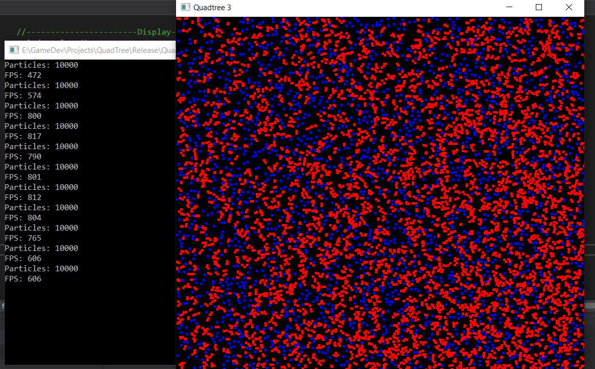

# Quadtree algorithm
A simple C++ project use quadtree algorithm to detect collision between particels.

## Results

- CPU		: Intel Core i5-7200U @ 2.50GHz (4 CPUs), ~2.7GHz
- Memory	: 8192MB RAM
- Renderer	: NVIDIA GeForce 940MX

### Release - ~1000 particles with ~1500 FPS

### Release - ~10000 particles with ~800 FPS
